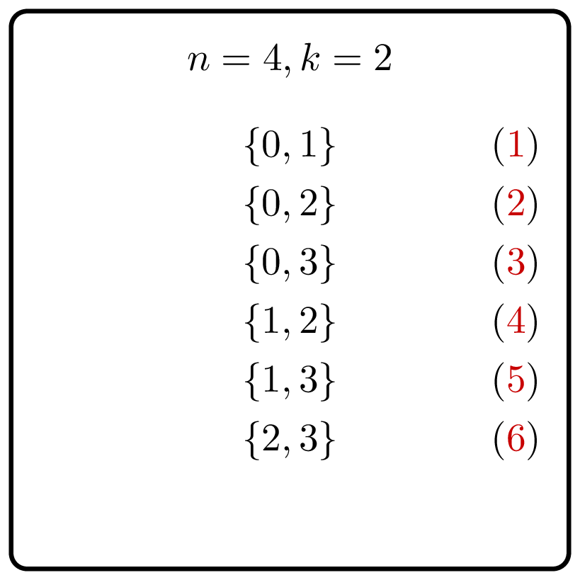
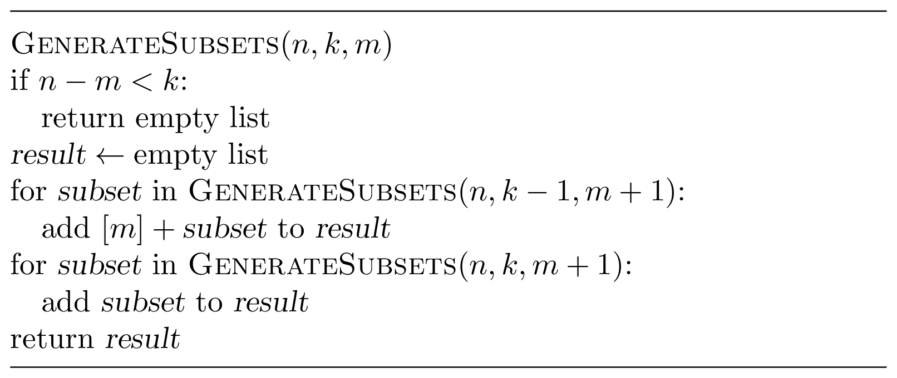

# Generate Subsets

    

Given integers $n$ and $k$, generate all subsets of 
the set $\lbrace 0, 1, 2, \dotsc, n - 1 \rbrace$ 
of size $k$.

### Input

Given `Int`'s $n$ and $k$ — the sizes of the set and 
the subsets, respectively ($0 \le k \le n \le 200$).

It is guaranteed that the size of the output (the number
of subsets)
does not exceed $10^6$.

### Output

Return a `List<BitSet>` that contains the required subsets.
The list should be lexicographically ordered.

### Example

| Input     | Returns                    |
|-----------|----------------------------|
| `2`, `1`  | `[[0], [1]]`               |
| `3`, `2`  | `[[0, 1], [0, 2], [1, 2]]` |

### Solution

Recall that the resulting list needs to be sorted. This suggests 
the following idea. First, generate all subsets of size $k$
containing 0. To do
this, generate recursively all subsets of size $k-1$ of the set 
$\lbrace 1, \dotsc, n-1 \rbrace$ and add $0$ to each of them.
Then, generate all subsets of size $k$ that do not contain $0$.
To do this, generate recursively all subsets of size $k-1$
of the set $\lbrace 1, \dotsc, n-1 \rbrace$.
To implement this recursive procedure, we pass to each recursive call
not only the parameters $n$ (the size of the universe set)
and $k$ (the size of subsets), but also an additional parameter $m$,
the minimum value of subsets to be generated. Thus, given $n$, $k$, 
and $m$, the procedure generates all subsets of size $k$
of the set $\lbrace m, m+1, \dotsc, n-1\rbrace$. If the number of
elements in this set, $n-m$, is smaller than $k$ (the base case of 
recursion), the resulting list is empty.

