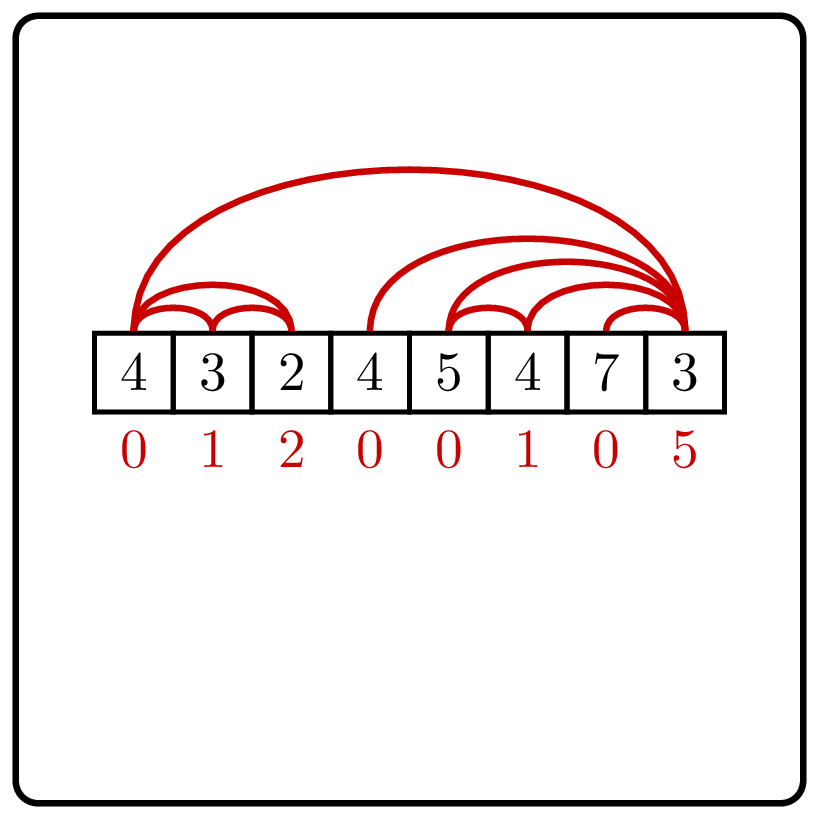

# Cound Inversions

    

Given a sequence $a_0, a_1, \dotsc a_{n - 1}$, 
find for each $i$ the number of inversions $a_i$
participates in, that is, the number of $0 \le j < i$
such that $a_j > a_i$.

The number of inversions in a sequence measures how close the 
sequence is to being sorted. For example, a sequence sorted in 
the non-descending order contains no inversions, while a 
sequence sorted in the descending order contains $n(n-1)/2$ inversions 
(every two elements form an inversion).

### Input

The given sequence is `List<T>`, where `T` implements `Comparable<T>`.

The `List<T>`'s random-access `get` method works in $O(1)$ time.

The sequence contains at most $10^6$ elements.

### Output

Return an `IntArray` whose $i$-th element is the number of inversions of $a_i$.

| Input             | Return value      |
|-------------------|-------------------|
| `[3, 1, 3, 4, 2]` | `[0, 1, 0, 0, 3]` |

A naive algorithm for the Number of Inversions Problem 
goes through all possible pairs $(i,j)$ and has running time $O(n^2)$. 
To solve this problem in time $O(n\log n)$ using the divide-and-conquer technique, split the input array
into two halves and make a recursive call on both halves. What remains to be done is computing the 
number of inversions formed by two elements from different halves. If we do this naively, 
it will bring us back to $O(n^2)$ running time, since the total number of such pairs is $\frac{n}{2} \cdot \frac{n}{2}=\frac{n^2}{4}=O(n^2)$. It turns out that one can compute the number of inversions formed by two elements from different halves in time $O(n)$ if both halves are already sorted. This suggests that instead of solving the original problem, we solve a more general problem: compute the number of inversions in the given array and sort it at the same time.

### Solution

Let us try the most frequently used type of the divide-and-conquer strategy:
split the input sequence into two halves, $\mathit{LeftHalf}$
and $\mathit{RightHalf}$, and make
a recursive call for each of them. This allows us to compute all
inversions that lie in the same half.
But it does not reveal
the
numbers of *split inversions*, i.e., the number of pairs $(a_i, a_j)$
such that $a_i$ lies in the left half, $a_j$ lies
in the right half, and $a_i>a_j$.

**Stop and think!** Consider an element $x$ in $\mathit{RightHalf}$.
What is the number of split inversions that $x$ belongs to?

Given an array $\mathit{List}$ and an integer $x$, let $\mathit{List}_x$
be the number of elements in $\mathit{List}$ that are larger than $x$.
Since the answer to the question above is $\mathit{LeftHalf}_x$, our goal is to
rapidly compute $\mathit{List}_x$.
This way, we face the following problem: given a sequence of integers
$\mathit{List}$ and an integer $x$, find the number of elements in $\mathit{List}$
that are smaller than $x$.
One can do it in $O(|\mathit{List}|)$ time in the case of an unordered array
(since each element of the array has to be checked) and
in $O(\log |\mathit{List}|)$ time in the case of an ordered array
by using the binary search.

**Stop and think!**
Show how to implement a method $\operatorname{CountLarger}(\mathit{List}, x)$
for counting the number of elements of $List$ that are larger than $x$
in time $\left\lceil \log_2|\mathit{List}| \right\rceil$ comparisons and $O(\log|\mathit{List}|)$ time.

This way, we arrive at the following divide-and-conquer algorithm.
* Make two recursive calls to count inversions in $\mathit{LeftHalf}$ and $\mathit{RightHalf}$.
* Sort $\mathit{LeftHalf}$.
* For every element $x$ in $\mathit{RightHalf}$, find the value of $\mathit{LeftHalf}_x$
  using the binary search.

The running time $T(n)$ (where $n$ is the length of $\mathit{List}$)
satisfies a recurrence relation
$$T(n) \le 2T(n/2)+O(n\log n).$$
The $O(n\log n)$ term includes two things: sorting $\mathit{LeftHalf}$
and answering $n/2$ $\operatorname{CountLarger}$ queries. This recurrence
cannot be plugged into the Master Theorem directly, as the term $O(n\log n)$
is not of the form $O(n^d)$ for a constant $d$. Still, one can analyze
this recurrence in the same fashion: the recursion tree has $\log_2 n$ levels,
the total size of all problems on every level is equal to $n$,
and the total time spent on every level is $O(n\log n)$.
Thus, the total running time is $O(n\log^2n)$.
Instead of formally proving it,
we will improve the above algorithm so that
it works in time $O(n\log n)$.

One can find all split inversions quickly if, together with counting
inversions, one sorts the input sequence. That is, assume that
the algorithm $\operatorname{CountInversionsAndSort}(\mathit{List})$
returns the numbers of inversions in $\mathit{List}$ and sorts $\mathit{List}$.
After two recursive calls, both halves of $\mathit{List}$
are sorted. At that point, we need to do two things:
sort the whole sequence $\mathit{List}$ and compute the number of split inversions.
We already know how to achieve the first goal: the $\operatorname{Merge}$ procedure
is responsible for that.
It proceeds as follows.
Let $l$ and $r$ be the first elements of (sorted) sequences $\mathit{LeftHalf}$ and
$\mathit{RightHalf}$. It chooses the smallest
out of them and moves it to the growing sorted list.

**Stop and think!** Can you find the number of split
inversions that the moved element forms?

Consider two cases.

 * $l \le r$. In this case, $l$ is not greater than every element of
$\mathit{RightHalf}$ and hence forms no split inversions.
 * $l > r$. In this case, $r$ is smaller than every element
of $\mathit{LeftHalf}$ and hence forms a split inversion
with every such element. We then increase the number of inversions of $x$
by the length of $\mathit{LeftHalf}$.

The running time $T(n)$ of the resulting algorithm satisfies
the recurrence $T(n)=2T(n/2)+O(n)$ and hence $T(n)=O(n\log n)$.

