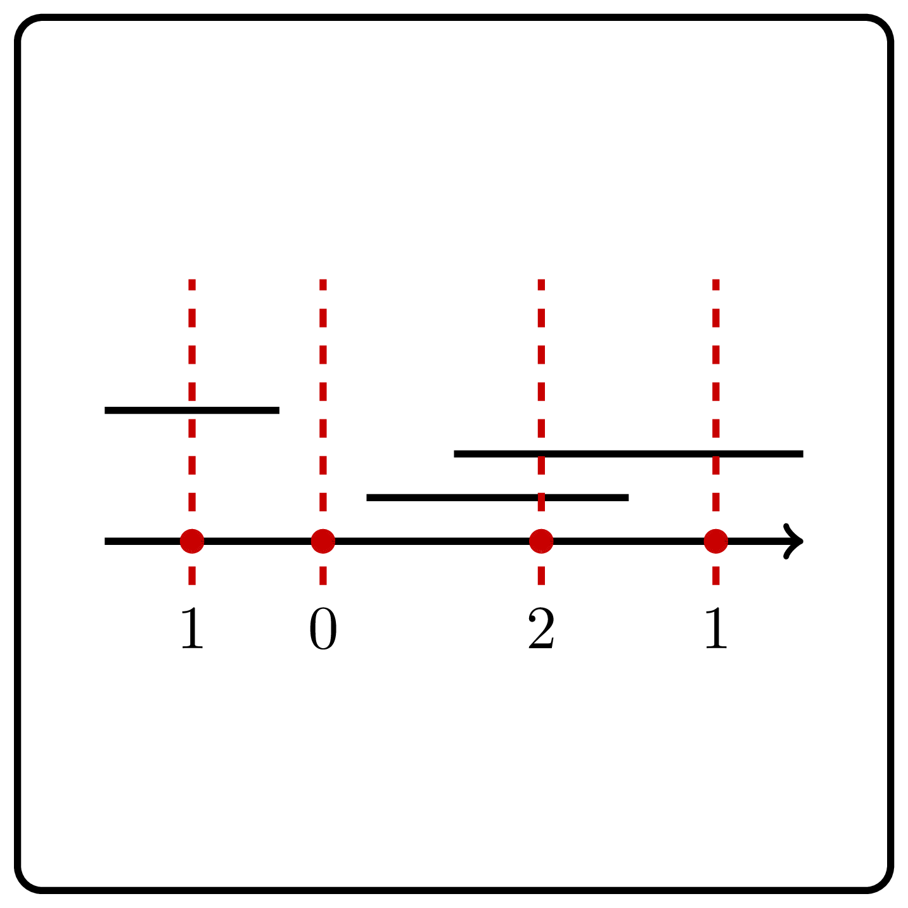

<style>
.samples th, .samples td {
    border: 1px solid black;
    border-collapse: collapse;
    padding: 15px;
    width: 300px;
    /*max-width: 100%;*/
    /*text-align: center;*/
    /*alignment: center;*/
}

.sample th, .sample td {
    border: 1px solid black;
    padding: 15px;
    width: 300px;
    /*max-width: 100%;*/
    /*text-align: center;*/
    /*alignment: center;*/
}

.sample td {
    border-top: none;
    border-bottom: none;
}

.sample table {
    border-collapse: collapse;
    border: 1px solid black;
}

.logo {
    display: flex;
    justify-content: center;
}

.logo img {
    width: 200px;
    align: center;
}

.code span {
    line-height: 22px;
}
</style>

# Points and Segments

<div class="logo">
    
</div>

Implement a function that given a set of points and a set of segments on a line, computes, for each point, the number of
segments it is contained in.

```Kotlin
fun countSegmentsForEach(points: IntArray, segments: Array<Pair<Int, Int>>): IntArray
```

### Input

An `IntArray` $x_0, x_1, \ldots, x_{n - 1}$ defining the points,
and an `Array<Pair<Int, Int>>` $[l_0, r_0], \ldots, [l_{m - 1}, r_{m - 1}]$
defining the segments.

The number of points doesn't exceed $300\,000$.

The number of segments doesn't exceed $300\,000$.

All the coordinates don't exceed $10^9$ by their absolute value.

### Output
An `IntArray` $d$ representing the number of segments containing each point, more formally $d_i$ should contain
the number of segments $[l_j, r_j]$ that contain point $x_i$.


<div class="samples">

| Input                                 | Return value |
|---------------------------------------|--------------|
| `[1, 6, 11]` `[[0, 5], [7, 10]]`      | `[1, 0, 0]`  |
| `[-100, 100, 0]` `[[-10, 10]]`        | `[0, 0, 1]`  |
| `[1, 6]` `[[0, 5], [-3, 2], [7, 10]]` | `[2, 0]`     |


</div>

<div class="hint">

# Solution

Let $\operatorname{before}(p)$ be the number of segments that end 
before a point $p$, $\operatorname{after}(p)$ be the number of 
segments that start after $p$, and $\operatorname{cover}(p)$ be 
the number of segments covering $p$.

**Exercise break.** Prove that for each point $p$, 
$$\operatorname{before}(p)+\operatorname{after}(p)+\operatorname{cover}(p)$$ 
is equal to the total number of segments.  

Hence, to count the number of segments that do not cover the 
given point $p$, it is sufficient to count the number of right-ends of 
segments that are smaller than $p$ and the number of left-ends of 
segments that are greater than $p$. If all left-ends and right-ends 
are sorted, one can use the binary search algorithm to perform such a 
check in $O(\log m)$ time. The corresponding solution has running 
time $O(m\log m + n\log m)$.
</div>