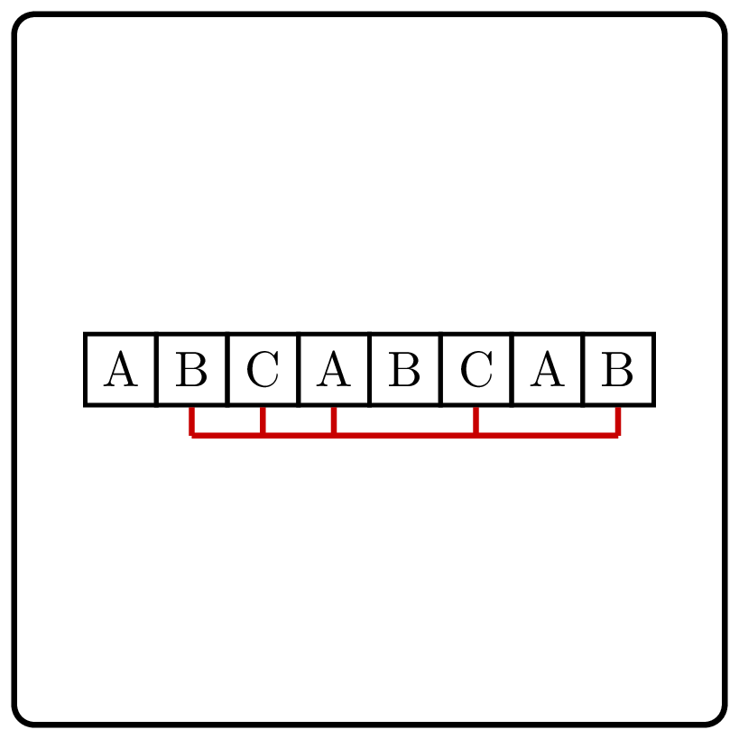
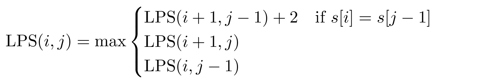
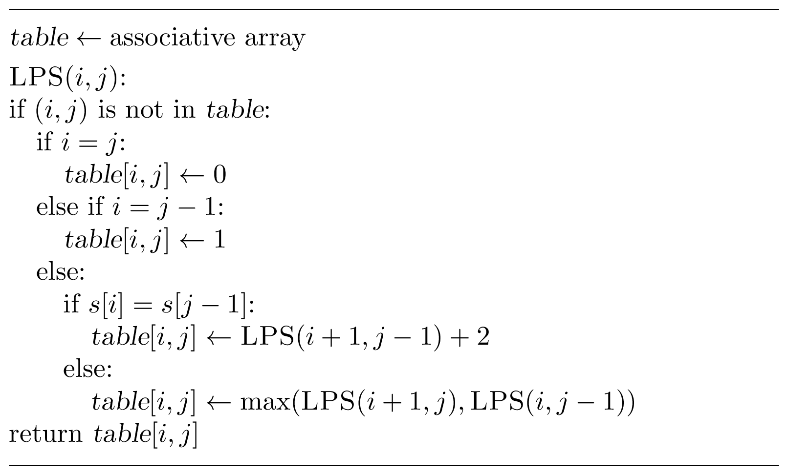
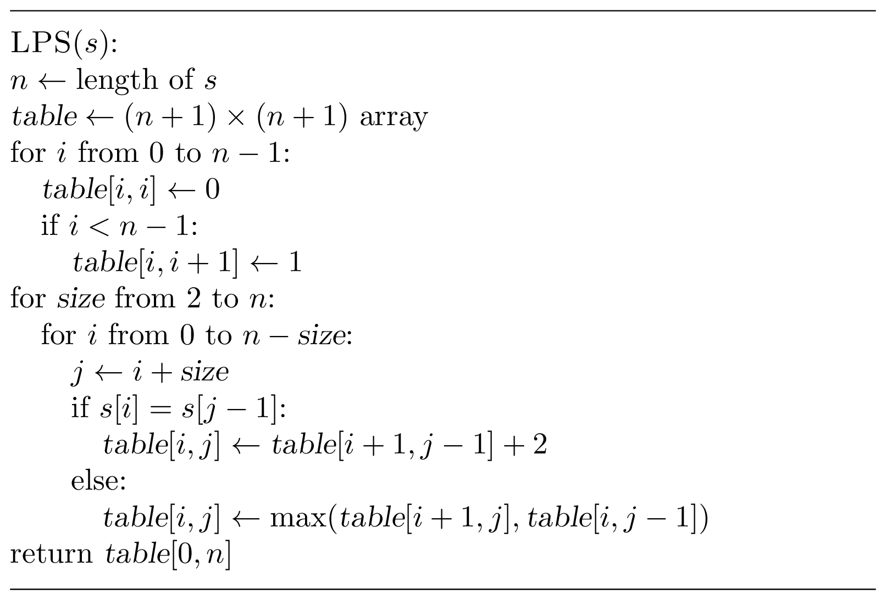

# Longest Palindromic Subsequence

    

Given a string, find the longest palindromic subsequence of this string, 
i.e., a subsequence that reads the same backward and forward.

This subsequence does not have to be contiguous.

### Input

A string consisting of lowercase English letters.
The length of the string doesn't exceed $5\ 000$. 

### Output

A string of maximum length that is a subsequence of the given string
and a palindrome at the same time.

If multiple answers exist, return any.

### Examples

| Input          | Returns     |
|----------------|-------------|
| `"bmczhadaem"` | `"madam"`   |
| `"abacaba"`    | `"abacaba"` |
| `"kotlin"`     | `"k"`       |

Focus on the first and the last symbols of the string. Either both of them appear
in the longest palindromic subsequence or at most one of them. Can you write
down a recurrence relation based on this observation?

### Solution

Let us focus on $s[0]$ and $s[n-1]$ —— the first and the last 
symbols of the string $s[0..n)$. If at least one of them does
not appear in the longest palindromic subsequence, then it
suffices to search for the longest palindromic subsequence in the
substrings $s[1..n)$ and $s[0..n-1)$. The case when both $s[0]$
and $s[n-1]$ appear in the longest palindromic subsequence
is only possible when $s[0]=s[n-1]$. Then, it remains to search
for the longest palindromic subsequence in $s[1..n-1)$ and append
the symbol $s[0]=s[n-1]$ on both sides.

As at every iteration we cut at least one symbol from one
of the two sides of the string, this leads us to the following recurrence relation.
Let $\operatorname{LPS}(i,j)$ be the length of the longest palindromic subsequence
in the substring $s[i..j)$. Then,

The base cases are: $\operatorname{LPS}(i,i)=0$ and $\operatorname{LPS}(i,i+1)=1$.
It remains to compute the values $\operatorname{LPS}(i,j)$ for all 
$0 \le i \le j \le n$ (using memoization) and then return the value of $\operatorname{LPS}(0,n)$.

The running time of this algorithm is proportional to the total number 
of subproblems, that is, $O(n^2)$.

One can also solve the problem iteratively (rather than recursively) as follows.
In this case, one needs to go through the subproblems in the order of increasing length
(to ensure that by the time one computes the value of $\operatorname{LPS}(i,j)$,
the values of $\operatorname{LPS}(i+1,j)$, $\operatorname{LPS}(i,j-1)$, and
$\operatorname{LPS}(i+1,j-1)$ have already been computed).

