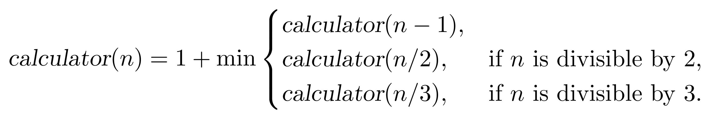
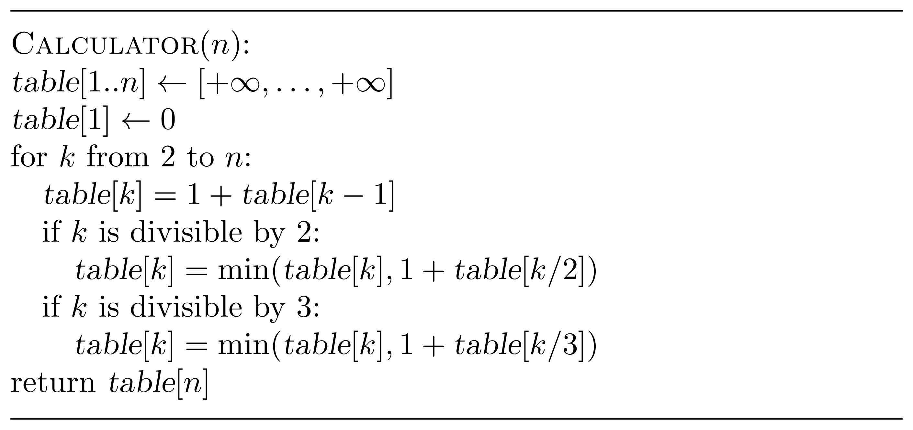
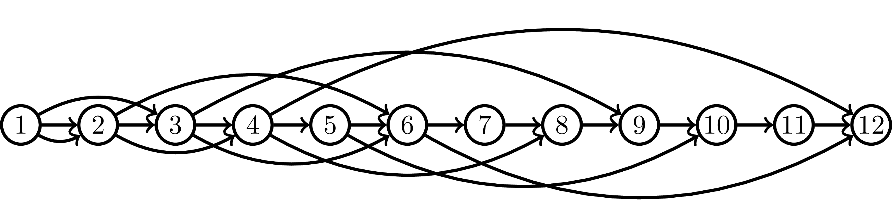

<style>
.samples th, .samples td {
    border: 1px solid black;
    border-collapse: collapse;
    padding: 15px;
    width: 300px;
    /*max-width: 100%;*/
    /*text-align: center;*/
    /*alignment: center;*/
}

.sample th, .sample td {
    border: 1px solid black;
    padding: 15px;
    width: 300px;
    /*max-width: 100%;*/
    /*text-align: center;*/
    /*alignment: center;*/
}

.sample td {
    border-top: none;
    border-bottom: none;
}

.sample table {
    border-collapse: collapse;
    border: 1px solid black;
}

.logo {
    display: flex;
    justify-content: center;
}

.logo img {
    width: 200px;
    align: center;
}

.code span {
    line-height: 22px;
}
</style>

# Primitive Calculator

Implement a function that finds the minimum number of operations needed
to get a positive integer $n$ from 1 by using only three operations:
- add 1,
- multiply by 2,
- multiply by 3.

```Kotlin
fun findMinimumOperations(n: Int): List<Int>
```

### Input

An `Int` $n$ ($1 \le n \le 10^6$), an integer to get from 1 by using the operations above.

### Output

Consider an optimal list of $k$ operations that transforms 1 into $n$.
The returned `List<Int>` should contain $k + 1$ integers that will appear while you perform these $k$ operations.
The integers should be listed in the order of their appearance, in other words, in increasing order.

<div class="samples">

| Input                                 | Return value                                                                  |
|---------------------------------------|-------------------------------------------------------------------------------|
| `1`                                   | `[1]`                                                                         |
| `96234`                               | `[1, 3, 9, 10, 11, 33, 99, 297, 891, 2673, 8019, 16038, 16039, 48117, 96234]` |

Note that in the second example, some other return lists may also be correct.

</div>


<div class="hint">

## Solution

Let ${calculator}(n)$ be the minimum number of operations needed 
to get $n$ from $1$. Since the last operation in an optimum
sequence of operations is "$+1$", "$\times 2$", or 
"$\times 3$", we get the following recurrence relation for $n \ge 1$:



This recurrence relation, together with the base 
case ${calculator}(1)=0$, can be mechanically converted into
a recursive and then into an iterative algorithm.



Recall, however, that besides the optimum value, we are asked
to output an optimum sequence of operations. To do this, let us notice that we can find the last operation as follows:
* it is "$+1$" if ${calculator}(n)=1+{calculator}(n-1)$;
* it is "$\times 2$" if $n$ is divisible by $2$ and ${calculator}(n)=1+{calculator}(n/2)$;
* it is "$\times 3$" if $n$ is divisible by $3$ and ${calculator}(n)=1+{calculator}(n/3)$.

This allows us to uncover an optimum sequence as follows:
* find the last operation;
* replace $n$ by $n-1$, $n/2$, or $n/3$ (depending on which of the three cases above happens);
* iterate (while $n>1$).


The running time of the algorithm is $O(n)$.

The algorithm finds implicitly the shortest path in a DAG like the one below.


</div>