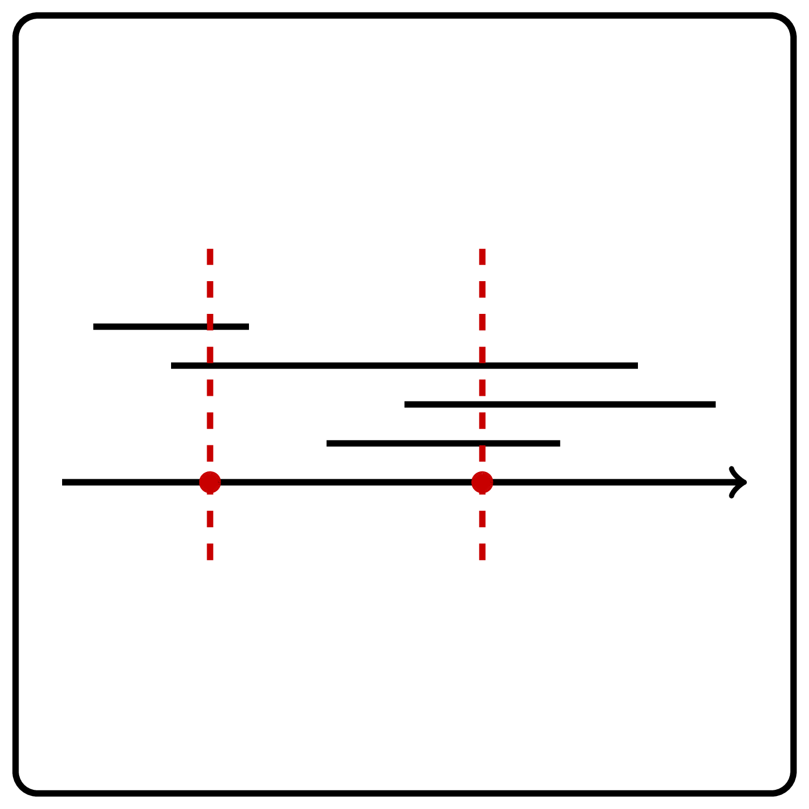
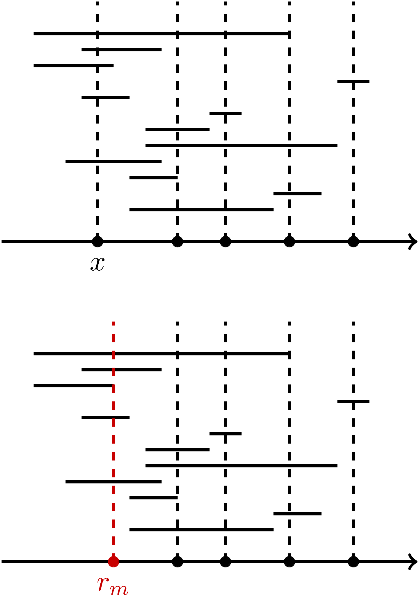
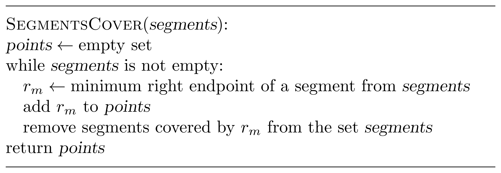

# Collecting Signatures

You are responsible for collecting signatures from all tenants in 
a building. For each tenant, you know the period of time when they 
are at home. You would like to collect all signatures by visiting the 
building as few times as possible. For simplicity, we assume that when 
you enter the building, you instantly collect the signatures of all 
the tenants who are in the building at that time.

Let's draw a diagram where each tenant will be represented as a segment
of time period when they are available. Now we need to solve the following
problem: find the minimum number of points needed to cover all the given segments
on a line.

Try our <a href="https://discrete-math-puzzles.github.io/puzzles/touch-all-segments/index.html">interactive puzzle</a> 
before solving this programming challenge!

    

### Input

The input of your function is a list $n$ of segments with borders
$l_i$ and $r_i$.

### Output

Your function should return the list of points that cover all 
given segments. The size of that list should be the minimal possible.
If there are multiple solutions, return any of them.

### Constraints

$1 \le n \le 100$; $0 \le l_i \le r_i \le 10^9$ for all $i$.

| Input                              | Return value |
|------------------------------------|--------------|
| `[(1, 3), (2, 5), (3, 6)]`         | `[3]`        |
| `[(4, 7), (1, 3), (2, 5), (5, 6)]` | `[3, 6]`     |

### Solution

Consider the smallest ending point of a segment: 
$r_m=\min\lbrace r_1, \dotsc, r_n\rbrace $. We claim that there exists an optimum 
solution containing the point $r_m$. To prove this, take an optimum solution $S$.
It must cover the
segment $[l_m,r_m]$, hence $S$ contains a point $x$ such 
that $l_m \le x \le r_m$. If $x=r_m$, then we are done. 
Otherwise, $x<r_m$. In this case,
we can replace $x$ by $r_m$ in $S$.

Clearly, this does not change the size of the solution $S$. 
To show that $S$ is still a solution, assume, 
for the sake of contradiction, that some segment 
$[l_i,r_i]$ is covered by $x$
but is not covered by $r_m$. This means that
\[l_i \le x \le r_i < r_m  ,\]
contradicting to the fact that $r_m$ is the smallest right end.

This way,
we arrive at the following algorithm:
add to a solution the minimum right end $r_m$,
discard all segments that are covered by $r_m$,
and iterate.

The picture below shows an example.

The running time is $O(n^2)$, where $n=|{segments}|$, 
since there are at most $n$ iterations of the {\tt while} loop 
(at least one segment is discarded at each iteration) and each iteration 
boils down to two scans of the list ${segments}$ 
(one scan to find the value of $r$ and another one to remove 
segments that are covered by $r$).

This algorithm is already sufficiently fast to pass the grader. 
To reduce the running time from $O(n^2)$ to $O(n\log n)$, 
you can simply sort segments in increasing order of their right 
endpoints and scan the resulting list just once.

