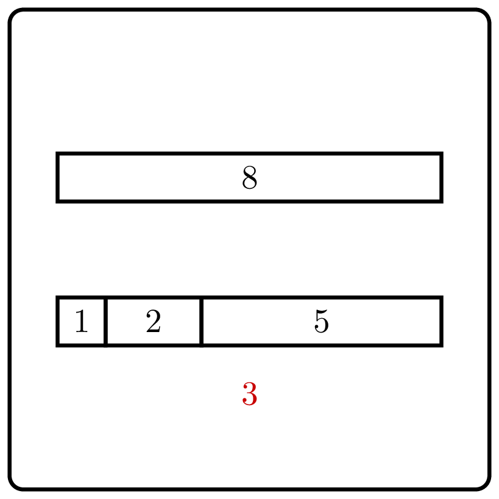

# Distinct Summands

    

Represent a positive integer as the sum of the
maximum number of pairwise distinct positive integers.

| Input | Return value |
|-------|--------------|
| 8     | 1 2 5        |
| 6     | 1 2 3        |
| 2     | 2            |

    Can one represent $8$ as the sum of four positive distinct integers?

    
### Solution

It is not difficult to see that one cannot represent 8 as the sum of four 
positive distinct integers.
Indeed, assume that $8=a_1+a_2+a_3+a_4$ and $a_1<a_2<a_3<a_4$.
Then, $a_1 \ge 1$, $a_2 \ge 2$, $a_3 \ge 3$, and $a_4 \ge 4$. But then
$a_1+a_2+a_3+a_4 \ge 10$.

For the same reason, if $n$ equals the sum of $k$ distinct positive
integers $a_1, \dotsc, a_k$, then
$$n=a_1+\dotsb+a_k \ge 1+\dotsb+k = \frac{k(k+1)}{2}.$$
The converse is also true: if $n \ge  \frac{k(k+1)}{2}$, then
one can represent $n$ as the sum of $k$ distinct integers.
Indeed, let $\delta=n-\frac{k(k+1)}{2} \ge 0$. Then, $n$ is equal
to the sum of the following integers:
$$1, 2, \dotsc, k-1,k+\delta.$$
It is not difficult to see that they are all different from each other.

The corresponding algorithm is straightforward:
find the largest value of $k$ such that $\frac{k(k+1)}{2} \le n$.
The running time is $O(n)$.

