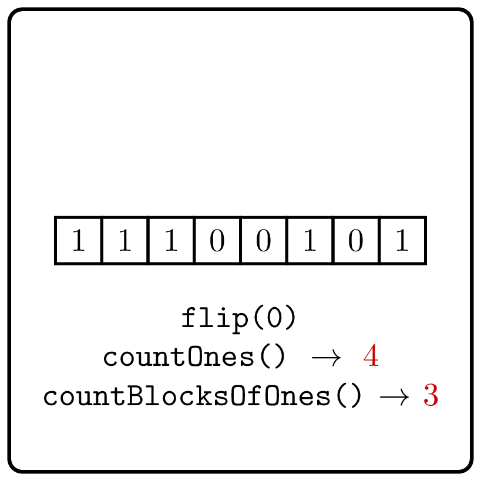

<style>
.samples th, .samples td {
    border: 1px solid black;
    border-collapse: collapse;
    padding: 15px;
    width: 300px;
    /*max-width: 100%;*/
    /*text-align: center;*/
    /*alignment: center;*/
}

.sample th, .sample td {
    border: 1px solid black;
    padding: 15px;
    width: 300px;
    /*max-width: 100%;*/
    /*text-align: center;*/
    /*alignment: center;*/
}

.sample td {
    border-top: none;
    border-bottom: none;
}

.sample table {
    border-collapse: collapse;
    border: 1px solid black;
}

.logo {
    display: flex;
    justify-content: center;
}

.logo img {
    width: 200px;
    align: center;
}

.code span {
    line-height: 22px;
}
</style>

# Count Blocks of Ones with Updates

<div class="logo">
    
</div>

Implement a class that supports the following three operations
for a given binary string: 
   1. get the number of 1's in the string,
   2. get the number of blocks of 1's in the string,
   3. flip a given bit of the string.


```Kotlin
class CountBlocksOfOnesWithUpdates {
    fun countOnes(): Int
    fun countBlocksOfOnes(): Int
    fun flip(index: Int)
}
```

### Example

<div class="sample">

| Input                                    | Returns                                                                             |
|------------------------------------------|-------------------------------------------------------------------------------------|
| `CountBlocksOfOnesWithUpdates("001001")` | [CountBlocksOfOnesWithUpdates](psi_element://CountBlocksOfOnesWithUpdates) instance |
| `countOnes()`                            | 2                                                                                   |
| `countBlocksOfOnes()`                    | 2                                                                                   |
| `flip(3)`                                |                                                                                     |
| `countOnes()`                            | 3                                                                                   |
| `countBlocksOfOnes()`                    | 2                                                                                   |
| `flip(4)`                                |                                                                                     |
| `countOnes()`                            | 4                                                                                   |
| `countBlocksOfOnes()`                    | 1                                                                                   |

</div>

<div class="Hint">
When the $i$-bit is flipped, what indices can become or stop being
a starting index of a block?
</div>

<div class="hint">

### Solution

Recall that an index $0 \le i < n$
is a starting index of a block of ones
of a binary string $s[0\dotsc n)$ if and only if
$$s[i]=1 \text{ and } (i=0 \text{ or } s[i-1]=0).$$
This expression reveals that this "status" of the $i$-th index 
depends on $s[i-1]$
and $s[i]$ only. 
When the $i$-th bit is flipped, it affects the status
of the indices $i$ and $i+1$. Thus, to update the number of blocks of
ones after the flip of the $i$-th bit, it suffices to compute the status
of the indices $i$ and $i+1$ before and after the flip.
</div>