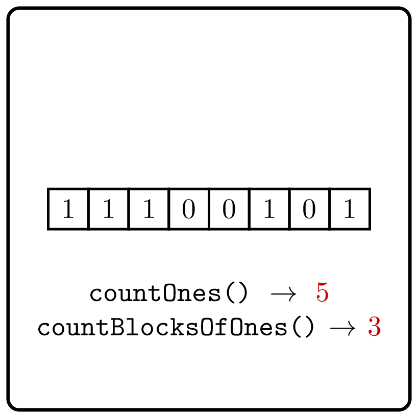

<style>
.samples th, .samples td {
    border: 1px solid black;
    border-collapse: collapse;
    padding: 15px;
    width: 300px;
    /*max-width: 100%;*/
    /*text-align: center;*/
    /*alignment: center;*/
}

.sample th, .sample td {
    border: 1px solid black;
    padding: 15px;
    width: 300px;
    /*max-width: 100%;*/
    /*text-align: center;*/
    /*alignment: center;*/
}

.sample td {
    border-top: none;
    border-bottom: none;
}

.sample table {
    border-collapse: collapse;
    border: 1px solid black;
}

.logo {
    display: flex;
    justify-content: center;
}

.logo img {
    width: 200px;
    align: center;
}

.code span {
    line-height: 22px;
}
</style>

# Count Blocks of Ones

<div class="logo">
    
</div>

Implement a function that computes the number of blocks of 1's in the binary string.

```Kotlin
fun countBlocksOfOnes(s: CharSequence): Int
```

### Input

Given a `CharSequence` $s$ — the binary string consisting of `0`s and `1`s. The length doesn't exceed $10^6$.

### Output

Return an `Int` representing the number of blocks in the binary string.

### Examples

<div class="samples">

| Input         | Returns |
|---------------|---------|
| `"001001"`    | 2       |
| `"11100101"`  | 3       |

</div>

<div class="Hint">
Given an index $0 \le i < n$, how would you check whether it is a starting
index of a block of ones in a binary string $s[0\dotsc n)$?
</div>

<div class="hint">

### Solution

An index $0 \le i < n$
is a starting index of a block of ones
of a binary string $s[0\dotsc n)$ if and only if
$$s[i]=1 \text{ and } (i=0 \text{ or } s[i-1]=0).$$
Thus, it suffices to count the number of $0 \le i < n$
satisfying the condition above.
</div>