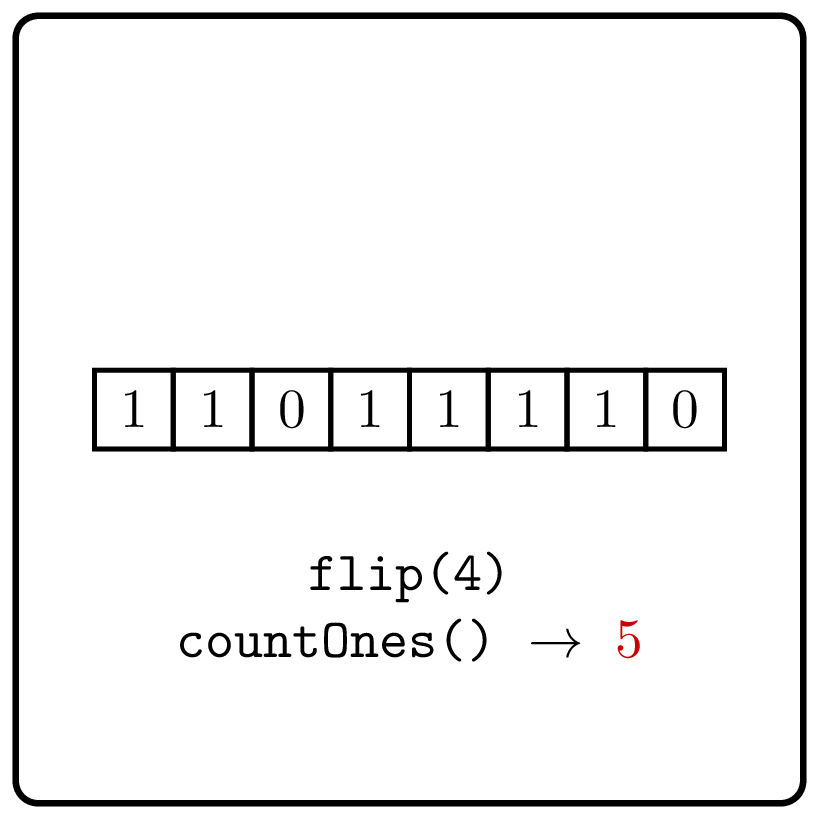

<style>
.samples th, .samples td {
    border: 1px solid black;
    border-collapse: collapse;
    padding: 15px;
    width: 300px;
    /*max-width: 100%;*/
    /*text-align: center;*/
    /*alignment: center;*/
}

.sample th, .sample td {
    border: 1px solid black;
    padding: 15px;
    width: 300px;
    /*max-width: 100%;*/
    /*text-align: center;*/
    /*alignment: center;*/
}

.sample td {
    border-top: none;
    border-bottom: none;
}

.sample table {
    border-collapse: collapse;
    border: 1px solid black;
}

.logo {
    display: flex;
    justify-content: center;
}

.logo img {
    width: 200px;
    align: center;
}

.code span {
    line-height: 22px;
}
</style>

# Count Ones with Updates
<div class="logo">
    
</div>

Implement a class that supports the following two operations
for a given binary string: get the number of 1's in the string
and flip a given bit of the string.

```Kotlin
class CountOnesWithUpdates {
    fun countOnes(): Int
    fun flip(index: Int)
}
```

### Example 1

<div class="sample">

| Input                            | Returns                                                             |
|----------------------------------|---------------------------------------------------------------------|
| `CountOnesWithUpdates("001001")` | [CountOnesWithUpdates](psi_element://CountOnesWithUpdates) instance |
| `countOnes()`                    | 2                                                                   |
| `flip(0)`                        |                                                                     |
| `countOnes()`                    | 3                                                                   |
| `flip(1)`                        |                                                                     |
| `countOnes()`                    | 4                                                                   |
| `flip(2)`                        |                                                                     |
| `countOnes()`                    | 3                                                                   |

</div>

<div class="hint">
How could you avoid 
counting the number of ones from scratch 
each time <code>countOnes</code> is called?
</div>

<div class="hint">

### Solution

Given a string, count the number of ones in it and store it
in a variable, say, `counter`. Then, each time `flip` is called,
adjust `counter` accordingly. In turn, when `countOnes` is called,
instead of counting the number of ones from scratch, just return the
value of `counter`.
</div>