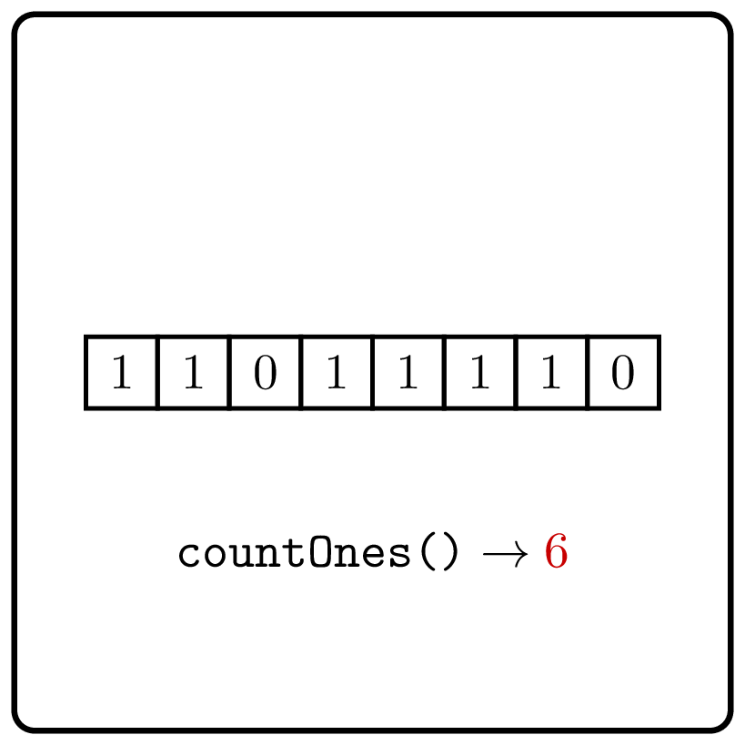

<style>
.samples th, .samples td {
    border: 1px solid black;
    border-collapse: collapse;
    padding: 15px;
    width: 300px;
    /*max-width: 100%;*/
    /*text-align: center;*/
    /*alignment: center;*/
}

.sample th, .sample td {
    border: 1px solid black;
    padding: 15px;
    width: 300px;
    /*max-width: 100%;*/
    /*text-align: center;*/
    /*alignment: center;*/
}

.sample td {
    border-top: none;
    border-bottom: none;
}

.sample table {
    border-collapse: collapse;
    border: 1px solid black;
}

.logo {
    display: flex;
    justify-content: center;
}

.logo img {
    width: 200px;
    align: center;
}

.code span {
    line-height: 22px;
}
</style>

# Count Ones
<div class="logo">
    
</div>

Implement a function that allows one to get the number of
1's in a given binary string.

```Kotlin
fun countOnes(seq: CharSequence): Int
```


### Examples

<div class="samples">

| Input        | Returns |
|--------------|---------|
| `"001001"`   | 2       |
| `"11100101"` | 5       |

</div>

<div class="hint">
A linear scan of the string is sufficient.
</div>

<div class="hint">

### Solution

Scan the string and count the number of ones. 
You can also use the built-in `count` method.
</div>