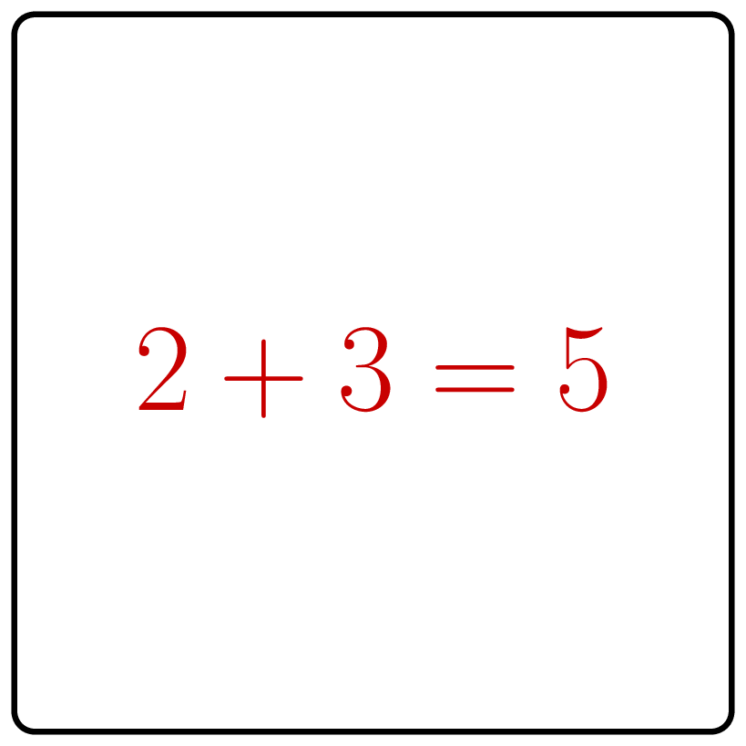
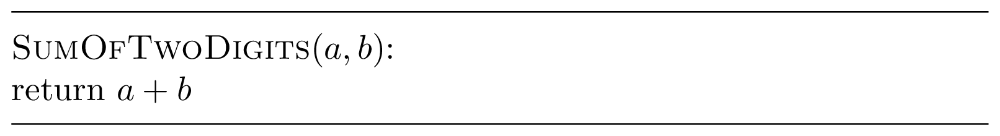

# Sum of Two Digits

    

Given two digits $0 \le a \le 9$ and $0 \le b \le 9$,
compute their sum.

### Example

| Input         | Returns |
|---------------|---------|
| `9, 7`        | `16`    |

We start from this ridiculously simple problem to show you the 
pipeline of reading the problem statement, designing an algorithm, 
implementing it, testing and debugging your program, and submitting 
it to the grading system.

### Solution

For this trivial problem, we will skip the 
“Designing an algorithm” step and will move right to the pseudocode.

This is how one can turn this pseudocode into Kotlin implementation.

    fun sumOfTwoDigits(a: Int, b: Int): Int {
        return a + b
    }

Copy-n-paste this solution into the file `Task.kt`
and press the "Check" button in the right pane. 
The automated grading system will check your solution
against several tests to verify that it 
always produces a correct answer and fits into the time 
and memory constraints.

In every programming challenge in this course, your goal is to implement an 
algorithm that produces a correct 
result under one second for any input satisfying 
the given constraints. You do not need to check that the input data satisfies 
the constraints: e.g., for the Sum of Two Digits Problem, you do not need 
to check that the given integers $a$ and $b$ are indeed single digit integers 
(this is guaranteed).

